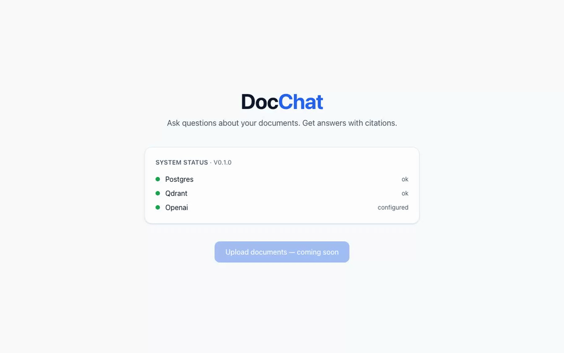
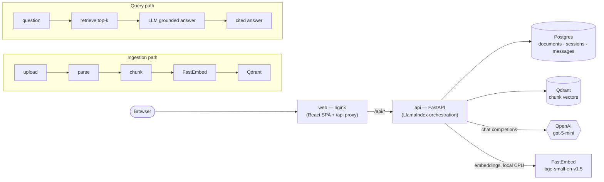

# DocChat

Ask questions about your documents. Get answers with citations — grounded strictly in what you uploaded.

Built for the Newpage Solutions fullstack AI take-home (Option 1: Chat With Your Docs).

## Demo



<sup>Recorded with Playwright against the running stack (`make video` re-records it —
source clip: [docs/media/demo.webm](docs/media/demo.webm)). Updated as features land.</sup>

## Quick start

**Prerequisites:** Docker (with Compose v2) and an OpenAI API key. Nothing else — Postgres,
Qdrant, and the embedding model all run locally in containers.

```bash
cp .env.example .env.local   # then put your real OPENAI_API_KEY in .env.local
docker compose up --build
```

Open <http://localhost:3000>. The API is at <http://localhost:8000> (OpenAPI docs at `/docs`).

Want a demo corpus to upload? `make fetch-samples` pulls a set of architecture docs into
`samples/docs/`.

> Deployment target is **localhost via docker compose** — that is the entire run story.
> [Productionization](#3-productionization-awsgcpazurecloudflare) is discussed below, not implemented.

### Troubleshooting

| Symptom | Likely cause | Fix |
|---|---|---|
| API logs `OPENAI_API_KEY is not set` and exits | Key missing from `.env.local` | Add a real key to `.env.local`, then `docker compose up` again. The api fails fast at startup by design, not at first question. |
| `bind: address already in use` on `:3000`, `:8000`, `:5432`, or `:6333` | A local process (or a previous run) holds the port | Stop the conflicting process, or remap the host port in `docker-compose.yml` (e.g. `3001:80`). |
| First request after a cold `up` is slow | FastEmbed downloads the ONNX embedding model (~80 MB) on first use | One-time. It is cached in the `fastembed_cache` volume, so later restarts are instant. |
| Health shows `qdrant: error` or `postgres: error` right after `up` | A data store is still starting | The api waits on healthchecks, but on a slow machine give it a few seconds and re-check `curl localhost:8000/api/health`. |

## 1. Architecture overview



**web (nginx).** Serves the built React/Vite SPA and reverse-proxies `/api/*` to the api
container, so the browser only ever talks to one origin — no CORS. SSE buffering is disabled so
streamed chat tokens arrive incrementally.

**api (FastAPI).** The whole backend: document upload/validation, the ingestion pipeline,
retrieval, the RAG chat engine with SSE streaming, and the health endpoint. Orchestrated with
LlamaIndex. Owns its schema (Alembic migrations run on startup) and fails fast if the OpenAI key
is missing.

**Postgres.** Relational state: document metadata + ingestion status, chat sessions, and chat
messages with their citations. Relational data does not belong in a vector store.

**Qdrant.** Stores the chunk embeddings (384-dim cosine) with payload metadata (`doc_id`,
`filename`, `page`, `chunk_index`, `text`) for retrieval and citation. Re-ingesting a document
deletes its old points by `doc_id` filter first.

**OpenAI (`gpt-5-mini`).** The only cloud dependency — generates the grounded answer from
retrieved context. Configured behind OpenAI-compatible env vars (see the [escape hatch](#api-cost--openai-compatible-escape-hatch)).

**FastEmbed (`bge-small-en-v1.5`).** Local ONNX embedding model running on CPU. Zero API cost
for ingestion and documents never leave the box to be embedded.

### Request lifecycle & observability

Every request gets an `X-Request-ID` at the edge (generated, or honored if the client sends one),
bound into the structured logger so **every log line for that request carries the id**. Chat
turns emit one JSON trace with the query, the retrieved node ids + scores, the model, and the
end-to-end latency. The `OPENAI_API_KEY` is redacted from all log output. Unhandled errors are
logged with context and returned to the client as a clean JSON message — never a raw 500 or a
blank screen.

## 2. API surface

Same-origin under `/api/*` (nginx proxies to the api container).

| Method | Path | Purpose |
|---|---|---|
| `GET` | `/api/health` | Liveness + dependency status (postgres, qdrant, openai) |
| `POST` | `/api/documents` | Upload a pdf/txt/md (multipart). `415` unsupported type, `413` oversized |
| `GET` | `/api/documents` | List documents with ingestion status |
| `DELETE` | `/api/documents/{id}` | Delete a document and its vectors |
| `POST` | `/api/retrieve` | Debug retrieval: `{ query, k? }` → scored nodes |
| `POST` | `/api/sessions` · `GET` `/api/sessions` · `GET` `/api/sessions/{id}` | Chat session CRUD |
| `POST` | `/api/sessions/{id}/messages` | Ask a question — streams the cited answer over SSE (rate-limited) |

## 3. Productionization (AWS / GCP / Azure / Cloudflare)

This runs on `docker compose` on one machine. The path to a hyperscaler deployment:

- **Secrets.** `.env.local` → a managed secret store: AWS Secrets Manager / GCP Secret Manager /
  Azure Key Vault, injected at runtime. The OpenAI key never lands in an image, a repo, or a log.
- **Data stores.** Compose Postgres/Qdrant → managed equivalents: RDS / Cloud SQL / Azure
  Database for Postgres, and Qdrant Cloud (or self-hosted Qdrant on Kubernetes with a persistent
  volume). Both move off the single-node compose volumes onto backed-up, replicated storage.
- **Compute.** The containers map onto a container runtime: ECS/Fargate, Cloud Run, Azure
  Container Apps, or Cloudflare Workers/Containers for the edge tier. The api is stateless
  (all state is in Postgres/Qdrant), so it autoscales horizontally behind a load balancer.
- **Edge & delivery.** TLS termination + ingress (ALB / Cloud Load Balancing / Front Door /
  Cloudflare), the SPA served from a CDN/object storage rather than an nginx container.
- **Operational additions for production:** an async ingestion queue (so large uploads don't tie
  up a request worker), CI/CD with the test + eval suites gated, automated DB/vector backups,
  centralized log aggregation for the JSON traces, a shared-store rate limiter (the current one is
  per-replica in-process), and authentication + per-user document isolation (see [deferred](#8-what-id-do-differently-with-more-time)).

## 4. RAG/LLM approach & decisions

> The factual choices are below; the **reasoning** in this section is written by hand per the
> brief ("we need your thoughts, not an LLM's direct output"). The tech-stack rationale in
> [`specs/tech-stack.md`](specs/tech-stack.md) is the input, not the final prose.

Final stack at a glance:

| Concern | Choice | Alternatives considered |
|---|---|---|
| LLM | OpenAI `gpt-5-mini` | `gpt-5` (higher quality/cost), local models (GPU burden on evaluators) |
| Embeddings | FastEmbed `bge-small-en-v1.5`, local ONNX, 384-dim | OpenAI `text-embedding-3-small` (per-token cost + data egress) |
| Vector DB | Qdrant | pgvector, other hosted vector DBs |
| Orchestration | LlamaIndex | LangChain, hand-rolled |
| Chunking | size `512`, overlap `64` (see `CHUNK_SIZE`/`CHUNK_OVERLAP`) | — |
| Retrieval | top-k `5`, score threshold `0.3` | — |

<!-- TODO(author, hand-write): the reasoning — why gpt-5-mini over gpt-5, why local FastEmbed
     over OpenAI embeddings, why Qdrant over pgvector, why LlamaIndex over LangChain/hand-rolled;
     the chunking rationale (why 512/64); prompt engineering (grounded-answer prompt + how the
     refusal path works); context management (history condensation under CHAT_TOKEN_BUDGET);
     guardrails (prompt-injection defense, input limits); quality (the eval matrix + thresholds
     from unit 09); observability (what the traces capture and why). Do NOT let an LLM draft this. -->

## 5. Key technical decisions

> The non-RAG engineering decisions. Factual list below; **hand-write the reasoning** for the
> ones that warrant it.

- **Monorepo** (`api/` + `web/` + `specs/`) — one clone, one `docker compose up`.
- **`uv` with a committed lockfile** — fast, reproducible Python installs.
- **Alembic migrations from commit one** — explicit schema history; migrations run on api startup.
- **nginx same-origin proxy** — the SPA calls `/api/*`, no CORS, the OpenAI key stays backend-only.
- **`.env` + `.env.local` secrets pattern** — `.env` defaults, gitignored `.env.local` overrides
  and wins; `.env.example` documents every variable; the key is never logged or shipped to the frontend.
- **Typed everywhere** — `mypy --strict` on the backend, strict TypeScript on the frontend.
- **Pinned versions** — Docker images by tag, Python deps via `uv.lock`, model ids pinned in config.

<!-- TODO(author, hand-write): pick the 2-3 decisions above that involved a real trade-off and
     explain your reasoning in your own words (e.g. why a monorepo here, why Alembic from day one
     for a take-home, why mypy strict). -->

## 6. Engineering standards followed — and skipped

**Followed:** typed code (mypy strict / strict TS), linting (ruff), migrations (Alembic),
tests where they earn their keep (parsing, retrieval, observability, one e2e), pinned/locked
versions, fully containerised, structured observable logging, spec-first development.

**Skipped — deliberately, given a take-home's time box:**

- No CI pipeline (tests + evals run locally via `make`, not gated on a PR).
- No authentication or multi-tenancy — every document is visible to every visitor.
- Evals are not gated (run on demand, not a merge gate).
- Single-node compose — no HA, no replication, no managed backups.
- Rate limiting is in-process per replica, not a shared store.

## 7. AI tools in the development process

> [`specs/`](specs/) is the AI-workflow exhibit: the project was built spec-first, decomposed into
> small units with per-unit validation gates, implemented by a coordinated agent team against
> fixed shared contracts.

<!-- TODO(author, hand-write): your actual workflow and your do's & don'ts — the brief asks
     specifically how YOU use AI coding tools and keep the output repeatable and maintainable.
     This must be your own words. Suggested points to cover from how this build actually went:
     spec-as-law, one writer per file, review every diff, tests before merge, where you let the
     LLM draft vs. where you wrote by hand (this section, and the reasoning sections, by hand). -->

## 8. What I'd do differently with more time

> Factual deferred list below; **hand-write** the prioritization and any insights from the build.

Deferred by design: authentication + multi-user document isolation, a reranking step after
retrieval, hybrid (dense + sparse/keyword) search, an async ingestion queue, evals gated in CI.

<!-- TODO(author, hand-write): which of these you'd reach for first and why, plus anything you
     discovered during the build that you'd change. Your own judgment, not an LLM's. -->

## API cost & OpenAI-compatible escape hatch

The only metered dependency is OpenAI, and only at **answer time** — embeddings run locally on
CPU via FastEmbed, so ingestion is free and your documents are never sent out to be embedded.
Each question is one `gpt-5-mini` chat completion over the retrieved chunks.

The LLM sits behind OpenAI-compatible env vars, so any compatible endpoint/provider swaps in with
no code change:

```bash
# in .env.local
LLM_BASE_URL=https://your-compatible-endpoint/v1
LLM_MODEL=your-model-id
```

`EMBED_MODEL` selects the local FastEmbed model (changing it requires re-ingestion — vector
dimensions must match the Qdrant collection).

## Development

```bash
make dev         # api with reload on :8000
make test        # backend tests
make typecheck   # mypy strict
make lint        # ruff
make migrate     # alembic upgrade head
make fetch-samples  # pull the demo corpus into samples/docs/
make e2e         # Playwright end-to-end against the running compose stack
```

Frontend dev server: `cd web && npm run dev` (Vite on :5173, proxies `/api` to :8000).

## Project layout

```
api/      FastAPI backend (app/, alembic/, tests/)
web/      React + Vite + TS + Tailwind SPA, nginx config + Dockerfile
e2e/      Playwright end-to-end test
specs/    The spec-first build: roadmap, tech stack, and the 10 build units
docs/     Screenshots and demo media
docker-compose.yml   The whole stack: web · api · postgres · qdrant
```
